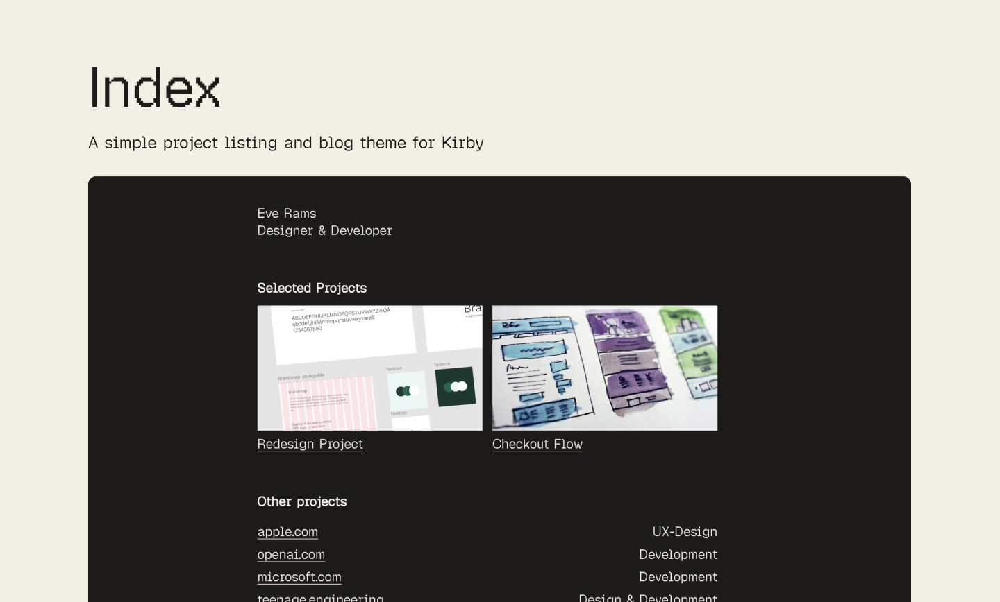

# Index – A minimal portfolio and blog theme for Kirby CMS



A minimal portfolio and blog theme for Kirby CMS. Built for Kirby 5 + PHP 8.2+.

Index is built for easy updates, not elaborate structure. No menu, no case studies, no complex navigation – because in my experience, that's where people get stuck and stop updating their portfolios.

List your work. Write when you want. That's it. The templates are simple to extend if you need more later.

## Features

### RSS Feed
Built-in RSS feed for your blog. Let readers subscribe and follow your writing without any extra setup.

### Sitemap
Automatic XML sitemap generation for search engines. Better indexing out of the box.

### Minimal CSS
Tiny CSS footprint. Fast loading, easy to understand, simple to modify. No preprocessors, no frameworks, no complexity.

### Adjustable colors (two-color palette)
Pick your primary and accent color. That's it. The constraint keeps your site cohesive and makes customization trivial. Change two variables, done.

### Geist font family
Ships with [Geist](https://vercel.com/font) by Vercel — Geist Pixel as the main display font, Geist Sans for body text. Both are licensed under the [SIL Open Font License](assets/fonts/OFL.txt) and load fast. Swap them out by overriding the CSS variables.

### Two blog listing styles
Choose between an index-style listing grouped by year, or a continuous feed that shows full posts in chronological order. Toggle between them from the Panel.

### Breadcrumbs and basic SEO fields
Essential SEO handled for you. Page titles, meta descriptions, breadcrumbs for navigation context. The basics done right.

### No build tools
No npm, no build process, no compilation step. Edit templates, refresh browser. That's it. Perfect for quick tweaks and easy deployment.

### Extensible via snippet overrides
Drop a `header-extra.php` snippet into `site/snippets/` to inject project-specific `<head>` content — OG images, analytics, custom meta tags — without touching the theme.

## Installation

### Requirements

- PHP 8.2 or higher (8.3+ recommended)
- A web server
- Kirby 5 (free for local development; license required for production — see [License](#license))
- Composer (Track A only — [getcomposer.org](https://getcomposer.org) if you don't have it)

### Starting point: Plainkit

Both installation tracks start from [Plainkit](https://getkirby.com/try) — Kirby's minimal starter kit. **Do not use Starterkit.** It ships with templates, blueprints, and sample content that conflict with the theme and are tedious to untangle.

Pick one track and follow it end to end — mixing them causes conflicts.

---

#### Track A: Composer

1. Create a new project from Plainkit:

```bash
composer create-project getkirby/plainkit my-site
cd my-site
```

2. Add the theme:

```bash
composer require eddiedale/index-theme
```

3. Remove the conflicting Plainkit files — see the step below.

---

#### Track B: ZIP download or Git submodule

1. Download [Plainkit](https://getkirby.com/try) and follow the [Kirby quickstart guide](https://getkirby.com/docs/guide/quickstart) to get it running locally. Then come back here.

2. Install the theme:

**Option 1: ZIP download**

- Download the ZIP from the [releases page](https://github.com/eddiedale/index-theme/releases)
- Extract it, rename the folder to `index-theme` if needed, and place it in `site/plugins/`

**Option 2: Git submodule** (recommended if your project is a git repo)

```bash
git submodule add https://github.com/eddiedale/index-theme.git site/plugins/index-theme
```

To pull in future theme updates:

```bash
git submodule update --remote site/plugins/index-theme
```

3. Remove the conflicting Plainkit files — see the step below.

---

### Remove conflicting Plainkit files (both tracks)

Plainkit ships with a few stub files that silently override the theme's versions. Kirby always prefers files in `site/` over plugin files, so these need to go.

From the root of your project, run:

```bash
rm site/blueprints/site.yml site/blueprints/pages/default.yml site/templates/default.php
```

These files only exist in a fresh Plainkit — skip any that aren't there.

After this, your structure should look like:

```
site/
└── plugins/
    └── index-theme/
        ├── index.php
        ├── blueprints/
        ├── templates/
        └── ...
```

---

### Starter content

The theme ships with a `content/` folder containing a ready-to-go homepage, blog with one sample post, and an error page. Remove Plainkit's default content first, then copy the theme's in:

```bash
rm -rf content/
cp -r site/plugins/index-theme/content/ content/
```

Replace it with your own content whenever you're ready.

---

### First run

Navigate to `/panel` in your browser. You'll be prompted to create an admin account — do that first, then start editing your content from the Panel.

## Configuration

The theme registers a few options you can set in `site/config/config.php`:

### `sitemap.ignore`

Pages to exclude from the sitemap. Defaults to `['error']`.

```php
return [
    'sitemap.ignore' => ['error', 'drafts'],
];
```

## Customisation

Kirby always checks `site/templates/`, `site/snippets/`, and `site/blueprints/` before the plugin. To override anything from the theme without modifying it, place a file with the same name in the corresponding `site/` folder.

For example, to customise the header, create `site/snippets/header.php` and Kirby will use that instead of the theme's version.

To inject content into `<head>` — analytics, OG image tags, custom meta — without touching the header template, create `site/snippets/header-extra.php`. The theme will automatically include it.

## What's Kirby?

[Kirby](https://getkirby.com) is a file-based CMS for PHP. If you're new to it, the [docs](https://getkirby.com/docs/guide) and [forum](https://forum.getkirby.com) are the best places to start.

## License

**The theme** is free and open source under the [MIT License](LICENSE.md). Use it, modify it, ship it — just keep the license and copyright notice.

**Kirby CMS** is a separate commercial product. It's free to use locally for development, but requires a paid license for production. Purchase one at [getkirby.com/buy](https://getkirby.com/buy).
