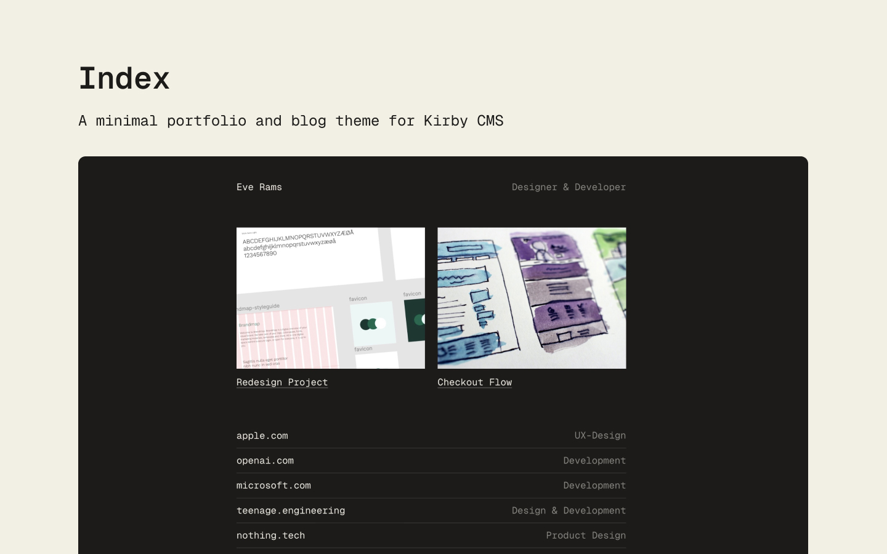

# Index – A minimal portfolio and blog theme for Kirby CMS



A minimal portfolio and blog theme for Kirby CMS. Built for Kirby 5 + PHP 8.2+.

Index is built for easy updates, not elaborate structure. No menu, no case studies, no complex navigation – because in my experience, that's where people get stuck and stop updating their portfolios.

List your work. Write when you want. That's it. The templates are simple to extend if you need more later.

## Features

### RSS Feed
Built-in RSS feed for your blog. Let readers subscribe and follow your writing without any extra setup.

### Sitemap
Automatic XML sitemap generation for search engines. Better indexing out of the box.

### Minimal CSS
Tiny CSS footprint. Fast loading, easy to understand, simple to modify. No preprocessors, no frameworks, no complexity.

### Adjustable colors (two-color palette)
Pick your primary and accent color. That's it. The constraint keeps your site cohesive and makes customization trivial. Change two variables, done.

### Geist font family
Ships with [Geist](https://vercel.com/font) by Vercel — Geist Mono as the main display font, Geist Sans for body text. Both are licensed under the [SIL Open Font License](assets/fonts/OFL.txt) and load fast. Swap them out by overriding the `--font-primary` (headings, index pages), `--font-secondary` (body copy) and `--font-mono` (code) CSS variables.

### Two blog listing styles
Choose between an index-style listing grouped by year, or a continuous feed that shows full posts in chronological order. Toggle between them from the Panel.

### Breadcrumbs and basic SEO fields
Essential SEO handled for you. Page titles, meta descriptions, breadcrumbs for navigation context. The basics done right.

### No build tools
No npm, no build process, no compilation step. Edit templates, refresh browser. That's it. Perfect for quick tweaks and easy deployment.

### Extensible via snippet overrides
Drop a `header-extra.php` snippet into `site/snippets/` to inject project-specific `<head>` content — OG images, analytics, custom meta tags — without touching the theme.

## Installation

There are two ways in — pick the one that fits you:

### New to Kirby? Use the kit (easiest)

Grab **`index-kit.zip`** from the [releases page](https://github.com/eddiedale/index-theme/releases).
It's a complete, ready-to-run site: Kirby, the theme, and starter content — already wired together.

1. Download and unzip it — into your web server's folder, or anywhere for local testing.
2. **No web server?** Open a terminal in the folder and run
   `php -S localhost:8000 kirby/router.php`, then visit `http://localhost:8000`.
3. Open `/panel` in the browser and create your account. Done — start writing.

Requirements: PHP 8.2+ (8.3+ recommended). Kirby is free to try locally;
production needs a [Kirby license](https://getkirby.com/buy).

Prefer Composer? `composer create-project` isn't offered — but the next option is just as quick.

### Already have a Kirby site? Install the theme directly

```bash
composer require eddiedale/index-theme
```

Or download the theme ZIP from the [releases page](https://github.com/eddiedale/index-theme/releases)
and place it in `site/plugins/index-theme`, or add it as a git submodule:

```bash
git submodule add https://github.com/eddiedale/index-theme.git site/plugins/index-theme
```

> **Coming from Plainkit?** Delete its stub files first — they silently override
> the theme's versions:
> `rm site/blueprints/site.yml site/blueprints/pages/default.yml site/templates/default.php`

### First run

Navigate to `/panel` in your browser, create your admin account, and start
editing your content from the Panel.

## Configuration

The theme registers a few options you can set in `site/config/config.php`:

### `sitemap.ignore`

Pages to exclude from the sitemap. Defaults to `['error']`.

```php
return [
    'sitemap.ignore' => ['error', 'drafts'],
];
```

## Customisation

Kirby always checks `site/templates/`, `site/snippets/`, and `site/blueprints/` before the plugin. To override anything from the theme without modifying it, place a file with the same name in the corresponding `site/` folder.

For example, to customise the header, create `site/snippets/header.php` and Kirby will use that instead of the theme's version.

To inject content into `<head>` — analytics, OG image tags, custom meta — without touching the header template, create `site/snippets/header-extra.php`. The theme will automatically include it.

## What's Kirby?

[Kirby](https://getkirby.com) is a file-based CMS for PHP. If you're new to it, the [docs](https://getkirby.com/docs/guide) and [forum](https://forum.getkirby.com) are the best places to start.

## License

**The theme** is free and open source under the [MIT License](LICENSE.md). Use it, modify it, ship it — just keep the license and copyright notice.

**Kirby CMS** is a separate commercial product. It's free to use locally for development, but requires a paid license for production. Purchase one at [getkirby.com/buy](https://getkirby.com/buy).
